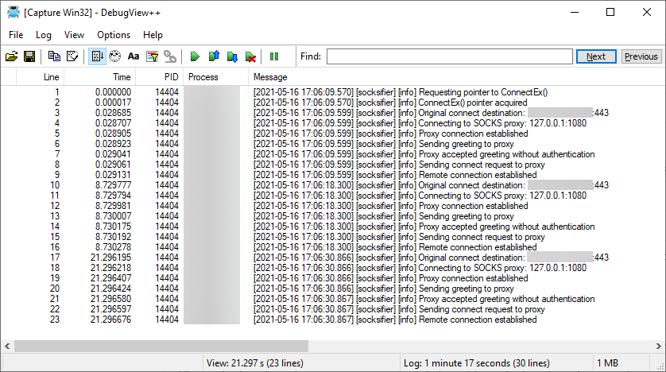

# Socksifier

A Windows DLL which hooks the `connect()` API to redirect sockets to a SOCKS5 proxy server.

 

## Motivation

Over time less and less modern network-enabled applications offer the user with the ability to specify an HTTP or SOCKS proxy server. For this specific need, so called "proxification" applications exist, which are unfortunately scarce and closed-source. This fork is an attempt to provide a modern, *working* and **open** solution for this very specific case.

## Build

[Follow the Vcpkg Quick Start](https://github.com/Microsoft/vcpkg#quick-start) and install the following packages:

- `.\vcpkg install spdlog:x86-windows-static spdlog:x64-windows-static detours:x86-windows-static detours:x64-windows-static`

## Getting started

You can get pre-built binaries (x86, x64) [at the release page](../../releases/latest).

To enable the redirection you just have to inject the DLL into your target process. Either use a [DLL injector tool](https://github.com/nefarius/Injector) or make injection persistent across application launches with additional help from [LoadDLLViaAppInit](https://blog.didierstevens.com/2009/12/23/loaddllviaappinit/) or similar tools (IAT patching and alike).

Optionally set up the following environment variables to configure the DLL. Default values are used if omitted.

- `SOCKSIFIER_ADDRESS` - IP address of the SOCKS5 proxy to connect to (defaults to `127.0.0.1`)
- `SOCKSIFIER_PORT` - Port of the SOCKS5 proxy to connect to (defaults to `1080`)

The default values assume that a [Shadowsocks client](https://github.com/shadowsocks/shadowsocks-windows) is running and listening on localhost.

## Diagnostics

The library logs to the Windows Debugger Backend and can be observed with [DebugView++](https://github.com/CobaltFusion/DebugViewPP) or similar.

## Sources

- [Windows Sockets Error Codes](https://docs.microsoft.com/en-us/windows/win32/winsock/windows-sockets-error-codes-2)
- [WSAEWOULDBLOCK error on non-blocking Connect()](https://stackoverflow.com/questions/14016579/wsaewouldblock-error-on-non-blocking-connect)
- [ConnectEx function](https://docs.microsoft.com/en-gb/windows/win32/api/mswsock/nc-mswsock-lpfn_connectex)
- [connect function](https://docs.microsoft.com/en-us/windows/win32/api/winsock2/nf-winsock2-connect)
- [WSAGetOverlappedResult function](https://docs.microsoft.com/en-gb/windows/win32/api/winsock2/nf-winsock2-wsagetoverlappedresult)
- [Working ConnectEx example](https://gist.github.com/joeyadams/4158972)
- [Simple SOCKS5 client written in C++](https://github.com/rudolfovich/socks5-client)
- [WSock Socks5 proxy forwarding POC](https://github.com/duketwo/WinsockConnectHookSocks5)
- [SOCKS Protocol Version 5](https://tools.ietf.org/html/rfc1928)
- [shadowsocks-windows](https://github.com/shadowsocks/shadowsocks-windows)
- [Sysinternals - Enumerate socket handles](https://web.archive.org/web/20120525235842/http://forum.sysinternals.com/socket-handles_topic1193.html)
- [Get name of all handles in current process](https://stackoverflow.com/q/8719252/490629)
- [Get a list of Handles of a process](https://www.cplusplus.com/forum/windows/95774/)
- [Hijacking connections without injections: a ShadowMoving approach to the art of pivoting](https://adepts.of0x.cc/shadowmove-hijack-socket/)
- [Lateral Movement by Duplicating Existing Sockets](https://www.ired.team/offensive-security/lateral-movement/shadowmove-lateral-movement-by-stealing-duplicating-existing-connected-sockets)
- [SYSTEM_HANDLE_TABLE_ENTRY_INFO](https://www.geoffchappell.com/studies/windows/km/ntoskrnl/api/ex/sysinfo/handle_table_entry.htm?ts=0,115)
- [Get Handle of Open Sockets of a Program](https://stackoverflow.com/q/16262114/490629)
